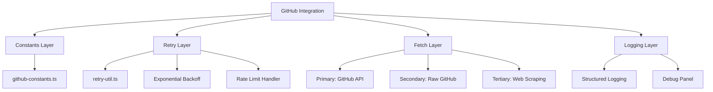
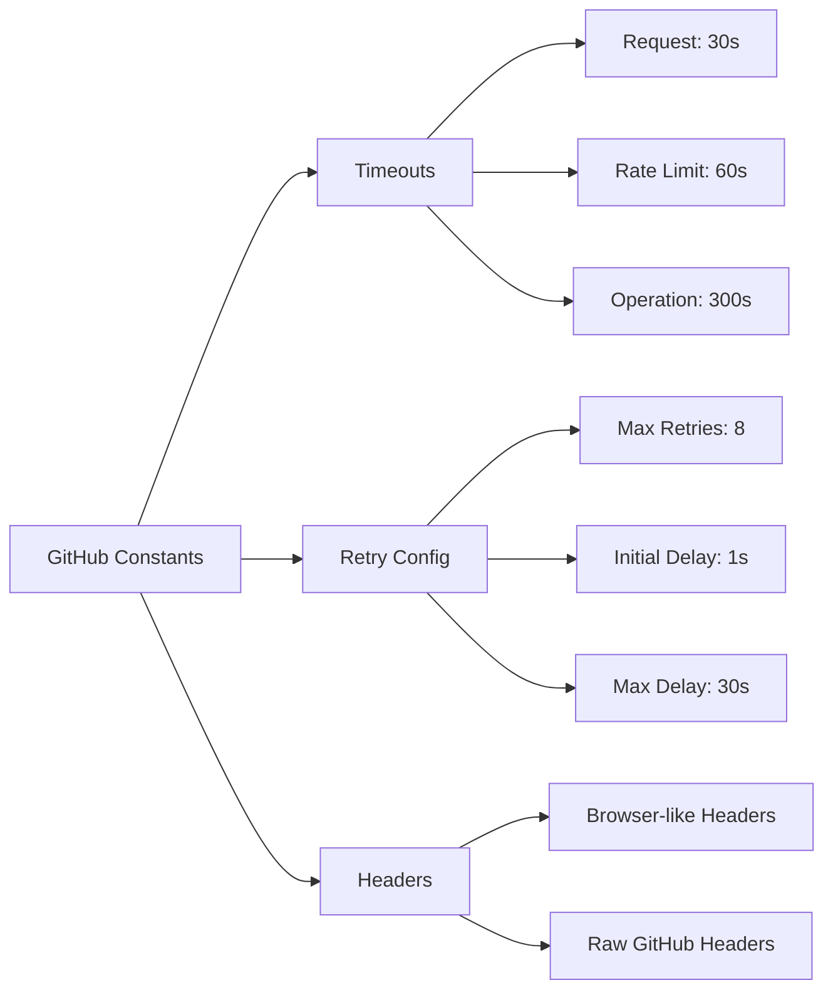
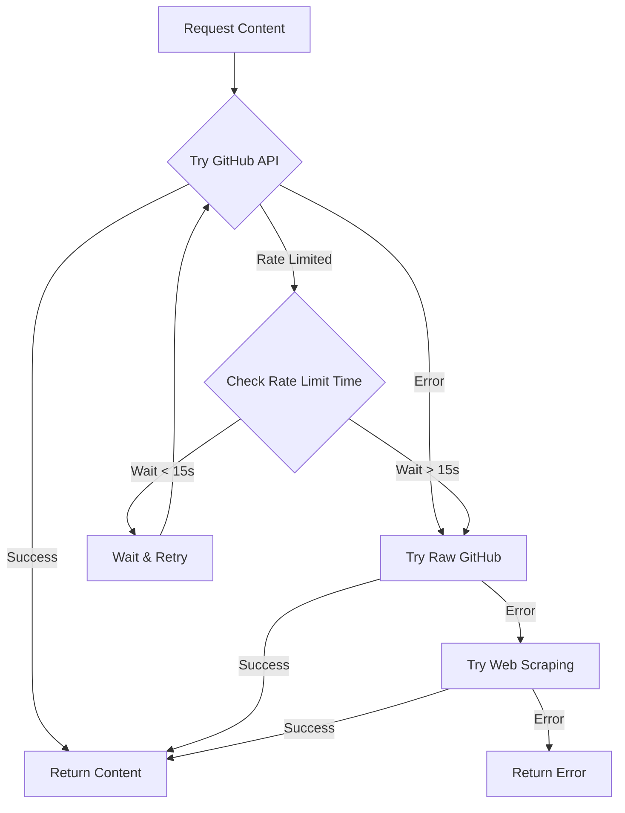
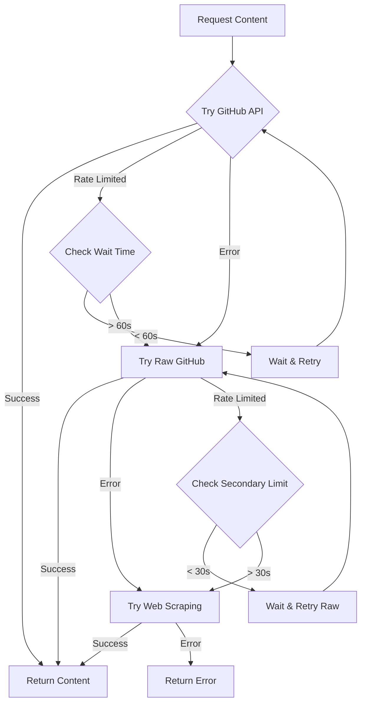
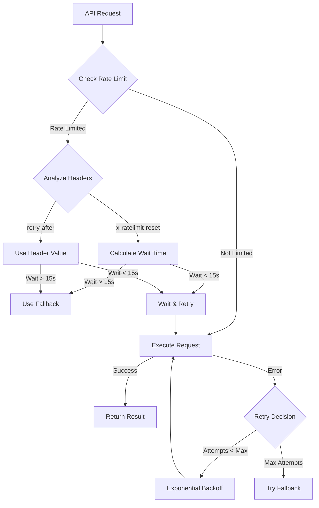
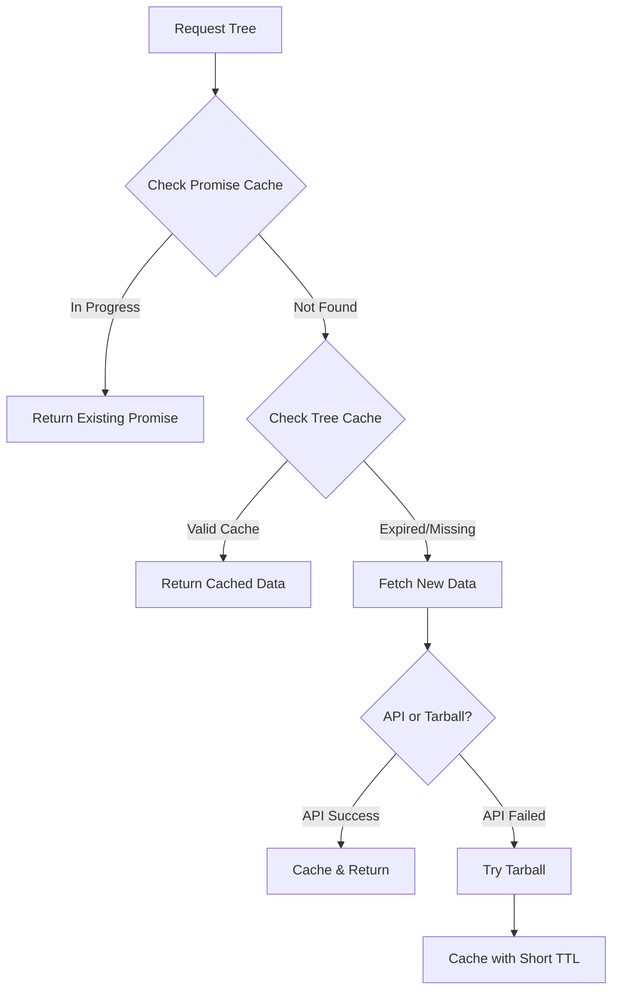
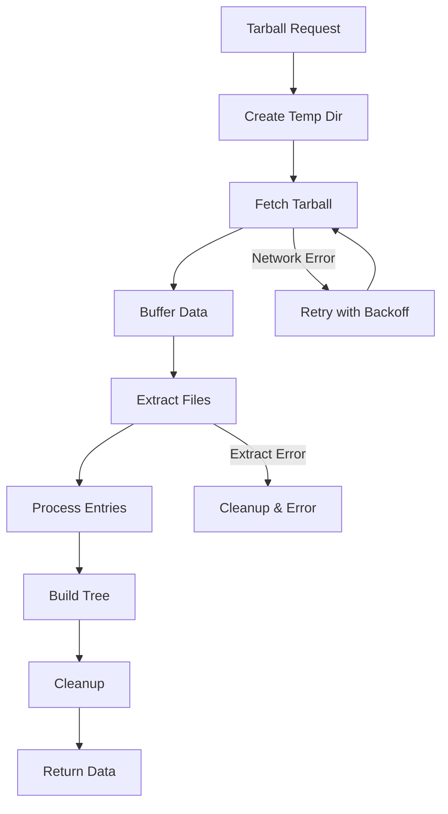
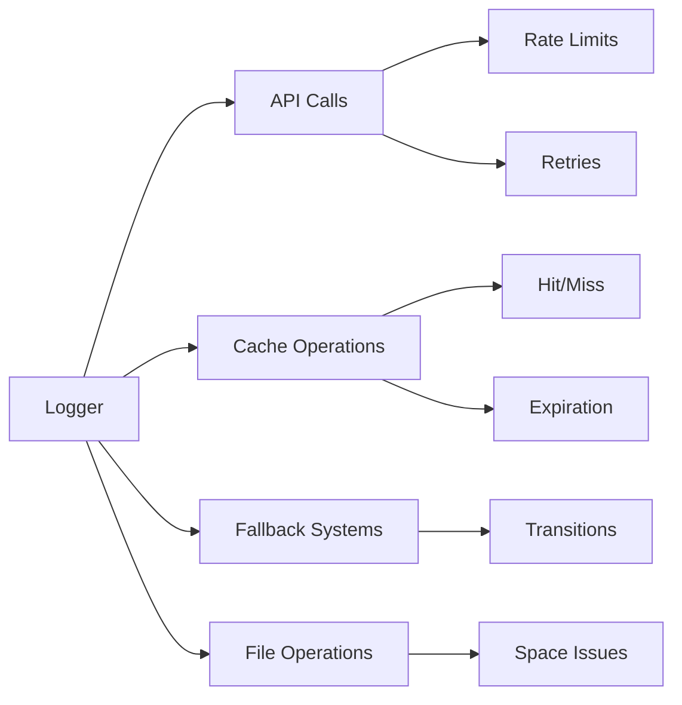

# GitHub Integration Documentation

This document describes the improved GitHub integration system used in the Help Center project. The system includes sophisticated retry mechanisms and fallback strategies to ensure reliable content delivery.

## Table of Contents

- [Overview](#overview)
- [Architecture](#architecture)
- [Configuration](#configuration)
- [Usage Examples](#usage-examples)
- [Error Handling](#error-handling)
- [Rate Limiting](#rate-limiting)
- [Debugging](#debugging)
- [Best Practices](#best-practices)
- [Advanced Caching System](#advanced-caching-system)
- [Tarball Fallback System](#tarball-fallback-system)
- [Enhanced Logging](#enhanced-logging)

## Overview

Our GitHub integration has been enhanced to provide:

- Robust error handling and recovery
- Efficient rate limit management
- Fallback mechanisms when API calls fail
- Configurable retry strategies
- Comprehensive logging
- Environment-based configuration
- High-level client interfaces

These improvements make the integration more reliable and developer-friendly, especially when working with GitHub API rate limits and intermittent network issues.

## Architecture



The GitHub integration is built around these core components:

1. **Config Layer** (`github-config.ts`): Environment-based configuration
2. **Client Layer** (`github-client.ts`): High-level client interface for GitHub operations
3. **API Layer** (`octokitConfig.ts`): Configured Octokit instance with throttling
4. **Utility Layer**:
   - `github-utils.ts`: Rate limit utilities and helpers
   - `getGithubFile.ts`: File fetching with improved error handling
   - `getGithubFileWithFallback.ts`: Enhanced file fetching with fallbacks
5. **Logging Layer** (`log-util.ts`): Chalk-based logging utilities

The architecture follows these principles:
- Separation of concerns
- Progressive fallback strategies
- Centralized configuration
- Detailed logging for debugging
- Resilience through retries and rate limit handling

## Configuration

### Environment Variables

Configure GitHub integration using these environment variables in your `.env.local` file:

```
GITHUB_APP_ID=your_github_app_id
GITHUB_INSTALLATION_ID=your_installation_id
GITHUB_PRIVATEKEY=your_private_key
```

### GitHub App Authentication

Our integration uses GitHub App authentication for better rate limits and security. To set up:

1. Create a GitHub App in your organization settings
2. Install the app in your target repositories
3. Download the private key
4. Set the environment variables as described above

The `getPEM.sh` script can be used to format your private key correctly:

```bash
./getPEM.sh "your-private-key-string-with-newlines-escaped"
```

## Configuration Constants

The system uses a centralized constants system defined in `github-constants.ts`:



## Fetch Strategy



## Enhanced Fetch Strategy



## Retry Mechanism

The system implements an intelligent retry mechanism with the following features:



## Key Features

1. **Smart Rate Limit Handling**
   - Respects both primary and secondary GitHub rate limits
   - Intelligent wait times based on rate limit reset headers
   - Maximum wait time of 15 seconds before switching to fallback

2. **Multiple Fallback Options**
   - Primary: GitHub API via Octokit
   - Secondary: Raw GitHub content
   - Tertiary: Web scraping fallback for critical operations

3. **Exponential Backoff**
   - Initial delay: 1000ms
   - Backoff factor: 2
   - Maximum delay: 30000ms
   - Includes jitter to prevent thundering herd

4. **Build vs Runtime Behavior**
   - Extended timeouts during build time
   - Stricter timeouts during runtime
   - Different retry strategies based on environment

## Usage Examples

### Fetching a File from GitHub

```typescript
import { getGithubClient } from '../utils/github-client';

async function fetchReadme() {
  const client = getGithubClient();
  
  try {
    const readmeContent = await client.getFile({
      owner: 'your-org',
      repo: 'your-repo',
      path: 'README.md',
      ref: 'main'
    });
    
    console.log('Readme content:', readmeContent);
  } catch (error) {
    console.error('Failed to fetch readme:', error);
  }
}
```

### Fetching with Fallback

When you need maximum reliability, use the fallback utility:

```typescript
import { getGithubFileWithFallback } from '../utils/getGithubFileWithFallback';

async function fetchImportantFile() {
  try {
    const fileContent = await getGithubFileWithFallback({
      owner: 'your-org',
      repo: 'your-repo',
      path: 'important-config.json',
      ref: 'main'
    });
    
    return JSON.parse(fileContent);
  } catch (error) {
    console.error('All fetch attempts failed:', error);
    throw error;
  }
}
```

### Making Direct API Calls

For more advanced scenarios, use the withGitHubAPI wrapper:

```typescript
import { withGitHubAPI } from '../utils/github-utils';

async function listRepositoryIssues() {
  return withGitHubAPI(async (octokit) => {
    const { data } = await octokit.issues.listForRepo({
      owner: 'your-org',
      repo: 'your-repo',
      state: 'open'
    });
    
    return data;
  });
}
```

## Error Handling

The GitHub integration includes comprehensive error handling:

### Error Types

- `RateLimitError`: GitHub API rate limit exceeded
- `NotFoundError`: Requested resource not found
- `AuthenticationError`: Issues with GitHub authentication
- `NetworkError`: Network-related issues
- `GitHubAPIError`: Generic GitHub API errors

### Handling Specific Errors

```typescript
import { getGithubClient } from '../utils/github-client';
import { RateLimitError, NotFoundError } from '../utils/github-utils';

async function safeGitHubOperation() {
  const client = getGithubClient();
  
  try {
    return await client.getFile({ owner, repo, path, ref });
  } catch (error) {
    if (error instanceof RateLimitError) {
      console.warn(`Rate limit hit, retry after ${error.resetTime}`);
      // Implement retry logic or fallback
    } else if (error instanceof NotFoundError) {
      console.error('File not found');
      // Handle missing file
    } else {
      console.error('Unexpected error:', error);
      // General error handling
    }
  }
}
```

## Rate Limiting

GitHub imposes API rate limits that our integration handles elegantly:

### Automatic Handling

The integration automatically:
- Detects rate limit errors
- Implements exponential backoff
- Retries failed requests when appropriate
- Provides detailed logging about rate limit status

### Manual Rate Limit Checking

```typescript
import { checkRateLimit } from '../utils/github-utils';

async function checkBeforeHeavyOperation() {
  const rateLimit = await checkRateLimit();
  
  if (rateLimit.remaining < 100) {
    console.warn(`Low on rate limits! ${rateLimit.remaining} remaining, resets at ${rateLimit.resetDate}`);
    // Consider deferring operations
    return false;
  }
  
  return true;
}
```

## Debugging

### Logging

The integration uses a chalk-based logging system for readability:

```typescript
import { logDebug, logWarning, logError } from '../utils/logging/log-util';

logDebug('Fetching file from GitHub');
logWarning('Rate limit approaching');
logError('Failed to authenticate with GitHub');
```

### Verbose Mode

Enable verbose mode to see detailed API interactions:

```typescript
import { setGithubClientVerbosity } from '../utils/github-client';

// Enable verbose logging
setGithubClientVerbosity(true);

// Later, disable it
setGithubClientVerbosity(false);
```

### Common Issues and Solutions

| Issue | Symptoms | Solution |
|-------|----------|----------|
| Auth failure | 401 errors | Check GITHUB_PRIVATEKEY format and permissions |
| Rate limiting | 403 errors with rate limit message | Implement caching, reduce API calls |
| File not found | 404 errors | Check file path and repo/branch names |
| Network issues | Timeout errors | Implement retries with longer backoff |

## Best Practices

1. **Cache when possible** to reduce API calls
   ```typescript
   // Example with a simple in-memory cache
   const fileCache = new Map();
   
   async function getCachedFile(params) {
     const cacheKey = `${params.owner}/${params.repo}/${params.path}@${params.ref}`;
     
     if (fileCache.has(cacheKey)) {
       return fileCache.get(cacheKey);
     }
     
     const content = await getGithubFile(params);
     fileCache.set(cacheKey, content);
     return content;
   }
   ```

2. **Batch operations** where possible instead of making many small requests

3. **Use conditional requests** with ETags to save on rate limits

4. **Implement appropriate error recovery** based on your application needs

5. **Monitor rate limits** proactively rather than reactively

6. **Use the high-level client** instead of direct Octokit calls when possible

7. **Follow GitHub's best practices** for API consumers

## Monitoring

The system includes comprehensive logging:
- Rate limit hits and wait times
- Retry attempts and delays
- Fallback transitions
- Error details and stack traces

All logs are tagged with operation names for easy tracking and debugging.

## Advanced Caching System



### Cache Layers
1. **Promise Deduplication Cache**
   - Prevents duplicate in-flight requests
   - Automatically cleaned up after completion
   - Helps prevent API rate limit exhaustion

2. **Tree Cache**
   - Caches repository tree data
   - Default TTL: 10 minutes
   - Shorter TTL (5 minutes) for fallback data
   - Hierarchical clearing options (by owner/repo/ref)

## Tarball Fallback System

When API access fails, the system can fall back to downloading and processing repository tarballs:



### Tarball Processing Features
- Creates unique temporary directories
- Handles large repositories efficiently
- Streams and processes data in chunks
- Includes comprehensive cleanup
- Retries on common filesystem errors

## Enhanced Logging



## Contributing to the GitHub Integration

When extending or modifying the GitHub integration:

1. Maintain the separation of concerns
2. Add comprehensive error handling
3. Include detailed logging
4. Update this documentation with new features or changes
5. Add appropriate tests for new functionality

---

_Last updated: [Current Date]_

