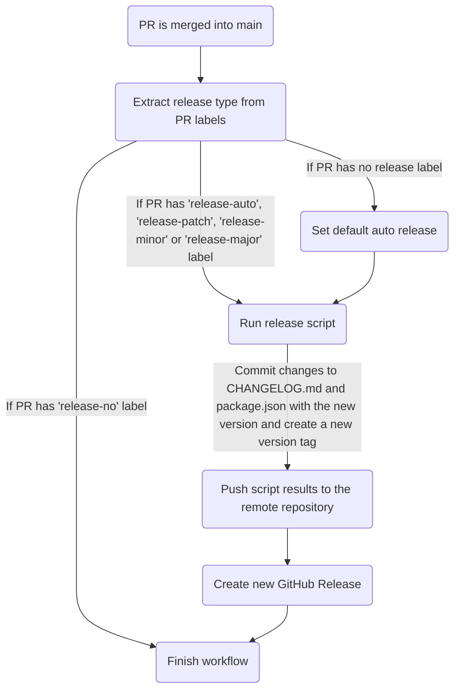
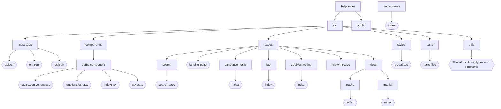

# Help Center

## Summary

- [About](#about)
  - [Objective](#objective)
  - [Concepts and Features](#concepts-and-features)
- [Versioning](#versioning)
- [Development](#development)
  - [Project Pattern](#project-pattern)
    - [Directory Tree](#directory-tree)
    - [React Preferences](#react-preferences)
    - [Code Linting and Format](#code-linting-and-format)
  - [Commits](#commits)
    - [How to make a commit](#how-to-make-a-commit)
  - [Branches](#branches)
    - [Feature Branches](#feature-branches)
  - [Navigation sidebar](#navigation-sidebar)
    - [Updating the navigation sidebar](#updating-the-navigation-sidebar)
  - [Redirects](#redirects)
    - [Creating a redirect](#creating-a-redirect)
- [GitHub Actions](#github-actions)
  - [Release Version Workflow](#release-version-workflow)
  - [Verify Pull Request Labels](#verify-pull-request-labels)
  - [Cypress Integration Tests](#cypress-integration-tests)
  - [Cypress Extensive Tests](#cypress-extensive-tests)
  - [Lighthouse Mobile Tests](#lighthouse-mobile-tests)
  - [Lighthouse Desktop Tests](#lighthouse-desktop-tests)
- [Contributing](#contributing)
  - [How to develop and propose a new contribution](#how-to-develop-and-propose-a-new-contribution)
  - [What to do when someone updated the `main` branch and I&#39;m developing something on my *feature branch*](#what-to-do-when-someone-updated-the-main-branch-and-im-developing-something-on-my-feature-branch)

## About

### Objective

This repository implements the new VTEX Help Center, improving merchants' experience as they consult our new feature announcements, tutorial articles, troubleshooting guides, and other documentation.

### Concepts and Features

As the Help Center provides VTEX documentation to users, some of its main features are:

- Multilingual content

  All information present in the Help Center Portal is displayed in three languages (English, Portuguese and Spanish), allowing easy access to the content available on the platform.
- Markdown files rendering

  [Markdown](https://www.markdownguide.org/) is a very popular markup language that helps making plaintext documents more semantic by adding formatting elements defined in its syntax. All documentation available on Help Center is written in markdown language.

## Versioning

The versioning process of this repository was built to automate version releases and standardize its contributions. The following goals are currently implemented:

- Standardize the repository history by adopting a commit messaging convention that makes commits more semantic

  [Commitlint](https://commitlint.js.org/#/) is a tool that lints commit messages according to Conventional Commits. [Conventional Commits](https://www.conventionalcommits.org/en/v1.0.0/), on the other hand, is based on the [SemVer (Semantic-Versioning)](https://semver.org/) standard.
- Automate `CHANGELOG.md` and `package.json` version updates based on semantic commit messages, as well as the creation of new version tags

  [Standard Version](https://github.com/conventional-changelog/standard-version) provides a release script that results in a release commit containing a new version in `package.json` and updates in `CHANGELOG.md`, all based on the changes introduced by the latest semantic commits. It also creates a new version tag.
- Automate new version releases when Pull Requests (PR) are merged into the `main` branch

  A GitHub action named **Release Version Workflow** is triggered whenever a PR is merged into the `main` branch. The action workflow contains steps that identify whether the PR should release a new version (and what type) to run the release script, submit its results, and generate a new GitHub Release corresponding to the new version's tag. The type of the new version may be automatically deducted from the semantic commits or determined by the user as a PATCH, MINOR or MAJOR.



## Development

1. Clone this repo, access the command line at its root directory and install all dependencies:

```bash
yarn install
```

2. To start the application development server, run:

```bash
yarn dev
```

3. Open [http://localhost:3000](http://localhost:3000) with your browser to see the result.

### Project Pattern

Help Center is a [Next.js](https://nextjs.org/) app based on [React](https://reactjs.org/) and [Typescript](https://www.typescriptlang.org/).

#### Directory tree

The diagram below represents the base structure defined to organize the files and folders of the repository, where all file names must follow the kebab-case convention.



#### React preferences

- It is preferable to use **arrow functions**
- It is preferable to use **functional components** instead of class components
- It is preferable to use **Hooks** over Higher Order Components (HOCs)

#### Code linting and format

- [ESLint](https://eslint.org/) is used to lint code and identify errors based on a pre-defined ruleset (`.eslintrc.json` file)

  Before any change is committed, a pre-commit hook will run the ESLint on JavaScript and TypeScript files located at pre-defined paths (such as `src/pages`, `src/components` etc) to fix their errors (ignored paths are described in `.eslintignore`).
- [Prettier](https://prettier.io/) is used to standardize the code formatting based on a pre-defined ruleset (`.prettierrc` file)

  Before any change is committed, a pre-commit hook will run Prettier and correct errors found in the appropriate files (ignored paths are included in `.prettierignore`).

You might want to configure ESLint and Prettier in your code editor to see errors and correction suggestions at development time.

### Commits

Within the repository we can consider three types of commit:

- __commits__: Default commits performed by the user on GitHub.
- __merge commits__: Commits through the command `git merge <branch> --no-ff` (it is also generated when merging a Pull Request without squashing).
- __release commits__: Commits made using [Standard Version](https://github.com/conventional-changelog/standard-version) tool.

  [Standard Version](https://github.com/conventional-changelog/standard-version) is a tool that simplifies the versioning process of a project. It has a release script that generates a new version tag and creates a __*release commit*__ containing: a new version in `package.json` and updates in `CHANGELOG.md` based on changes introduced by the latest __*commits*__.

#### How to make a commit

- **Step 1.** Stage the desired changes:

  ```bash
  git add <filenames>
  ```
- **Step 2.** Commit your staged files:

  - **Option 1:** Use the [Commitizen](https://github.com/commitizen/cz-cli) script to make your **commit** with an interactive step-by-step via command line that helps generating semantic descriptions that follow the [Conventional Commits](https://www.conventionalcommits.org/en/v1.0.0/) model. Instead of runing `git commit`, run the command below and follow the instructions that will appear:

    ```bash
    yarn cz-commit
    ```
  - **Option 2:** Make your **commit** manually following the [Conventional Commits](https://www.conventionalcommits.org/en/v1.0.0/) model:

    ```
    <type>[optional scope]: <description>

    [optional body]

    [optional footer(s)]
    ```

    If there are any breaking changes introduced by your changes, follow one of the options:

    - Append a `!` after `<type>[optional scope]`
      ```
      <type>[optional scope]!: <description>

      [optional body]

      [optional footer(s)]
      ```
    - Add `BREAKING CHANGE: < breaking change description>` to the footer
      ```
      <type>[optional scope]: <description>

      [optional body]

      BREAKING CHANGE: <breaking change description>
      ```

    The `<scope>` may specify the context of the applied changes (e.g. subject, component or file name), as well as the `<body>` may help explaning the commit in more details. The `<type>` helps making commit messages more semantic and all options are described in the table below.

    <a href="commit-types-table" id="commit-types-table"></a>
    Commit `<type>` Options | Description | Release*
    -----|-------------|---------------
    `fix` | fixes bugs in your codebase | PATCH
    `feat` | introduces a new feature to the codebase | MINOR
    `docs` | documentation only changes | PATCH
    `style` | changes that do not affect the meaning of the code (white-space, formatting, missing semi-colons, etc) | PATCH
    `refactor` | a code change that neither fixes a bug nor adds a feature | PATCH
    `perf` | a code change that improves performance | PATCH
    `test` | adds missing tests or corrects existing tests | PATCH
    `build` | changes that affect the build system or external dependencies (scope examples: gulp, broccoli, npm) | PATCH
    `ci` | changes to CI configuration files and scripts (scope examples: Travis, Circle, BrowserStack, SauceLabs) | PATCH
    `chore` | other changes that don't modify src or test files | PATCH
    `revert` | changes that revert previous commits | PATCH

    __* [SemVer specification says the MAJOR version zero (0.y.z) is for initial development](https://semver.org/#spec-item-4). Because of this, until this repository reaches a first stable version of Help Center (with a specified major release), the automatic release won't lead to any MAJOR version, but only PATCH and MINOR (breaking changes commits will result in MINOR bumps).__

    **Examples:**

    ```bash
    # Commit message without scope, body, footer or breaking change
    chore: add favicon

    # Commit message with scope
    ci(versioning): add Release-Version GitHub workflow

    # Commit message with scope and breaking change
    feat(api)!: send an email to user when a request is submitted

    # Commit message with breaking change (footer)
    chore: drop support for Node 6

    BREAKING CHANGE: use JavaScript features not available in Node 6.
    ```

  **What *NOT* to do:**

  - Add dot in the end of text. E.g.: `chore: add favicon.`
  - Start with uppercase. E.g.: `feat(api): Send an email to user when a request is submitted`
  - Write in Portuguese. E.g.: `chore: Atualizar a navigation sidebar`

### Branches

Currently, we have one fixed branch: `main`.

The `main` branch must reflect exactly what is deployed in production, it should be treated as __*the single source of truth*__. It is from `main` where every development branch is created.

> **Important note:** Only *merge commits* should be made by developers on `main` branch.

#### Feature branches

You must create a branch based on `main` to start a feature, improvement, or fix. This branch is called a *feature branch*. It must have the following structure name: `<type>/<description>`
Choose the `type` that best summarizes your contribution at the [Commit Types Table](#commit-types-table).

The *feature branch* description must be short and written with kebab-case. It should give a basic understanding of what is being developed on the branch.

E.g.: `git checkout -b feature/landing-page`.

> **Important note:** Only *commits* should be made in a *feature branch*. None *release or merge commits* should be made.

### Navigation sidebar

To display an article in the Help Center navigation sidebar, you need to update the [navigation.json](https://github.com/vtexdocs/helpcenter/blob/main/public/navigation.json) file located inside the [helpcenter](https://github.com/vtexdocs/helpcenter) repository.

The excerpt below shows an example of how the first articles in the Tutorials section are listed within this file:

```json
{
        {
         "documentation": "Tutorials",
         "slugPrefix": "docs/tutorials",
         "categories": [
            {
               "name": {
                  "en": "Beta",
                  "es": "Beta",
                  "pt": "Beta"
               },
               "slug": {
                  "en": "category-beta-products",
                  "es": "categoria-beta-producto",
                  "pt": "categoria-produtos-beta"
               },
               "origin": "",
               "type": "markdown",
               "children": [
                  {
                     "name": {
                        "en": "Subscriptions Beta",
                        "es": "Suscripciones Beta",
                        "pt": "Assinaturas Beta"
                     },
                     "slug": {
                        "en": "subscriptions-beta",
                        "es": "suscripciones-beta",
                        "pt": "assinaturas-beta"
                     },
                     "origin": "",
                     "type": "category",
                     "children": [
                        {
                           "name": {
                              "en": "Subscription plans",
                              "es": "Planes de suscripción",
                              "pt": "Planos de assinatura"
                           },
                           "slug": {
                              "en": "subscription-plans",
                              "es": "planes-de-suscripcion",
                              "pt": "planos-de-assinatura"
                           },
                           "origin": "",
                           "type": "markdown",
                           "children": []
                        },
                        {
                           "name": {
                              "en": "Creating a subscription plan",
                              "es": "Cómo crear un plan de suscripción",
                              "pt": "Como criar um plano de assinatura"
                           },
                           "slug": {
                              "en": "creating-a-subscription-plan",
                              "es": "como-crear-un-plan-de-suscripcion",
                              "pt": "como-criar-um-plano-de-assinatura"
                           },
                           "origin": "",
                           "type": "markdown",
                           "children": []
                        }
                     ]
                  },
...
}
```

#### Updating the navigation sidebar

Follow the steps below to add new content to the navigation sidebar:

1. Open a [feature branch](#feature-branches) in this repository.
2. In the [navigation.json](https://github.com/vtexdocs/helpcenter/blob/main/public/navigation.json) file, locate where you want the new article reference to appear in the side bar navigation menu.
3. Copy and paste the structure below into the JSON file, replacing the names of the articles (one version per locale) within the `name` object, and the respective slugs in the `slug` object.

   ```json
      {
         "name": {
            "en": "Creating a subscription plan",
            "es": "Cómo crear un plan de suscripción",
            "pt": "Como criar um plano de assinatura"
         },
            "slug": {
               "en": "creating-a-subscription-plan",
               "es": "como-crear-un-plan-de-suscripcion",
               "pt": "como-criar-um-plano-de-assinatura"
         },
            "origin": "",
            "type": "markdown",
            "children": []
      }
   ```
4. Save the file.
5. Commit the modifications as follows:

   - **Step 1:** Go to the folder where `navigation.json` is located.

   ```bash
   cd public
   ```

   - **Step 2:** Stage the desired changes.

   ```bash
   git add navigation.json
   ```

   - **Step 3:** Commit the file.

   ```bash
   yarn cz-commit
   ```

   - **Step 4:** Move the cursor down to the `docs: Documentation only changes` option and click enter.

   ```bash
   > docs: Documentation only changes
   ```

   - **Step 5:** Describe the purpose of this modification. This step can be skipped if desired.

   ```bash
   ? What is the scope of this change (e.g. component or file name): (press enter to skip)
   ```

   - **Step 6:** Briefly describe the changes made.

   ```bash
   ? Write a short, imperative tense description of the change (max 94 chars): Update the navigation bar to include the article "How to register a product in the catalog".
   ```

   - **Step 7:** Describe in detail the changes made. This step can be skipped if desired.

   ```bash
   ? Provide a longer description of the change: (press enter to skip)
   ```

   - **Step 8:** Enter **N** to indicate that the modification is not a breaking change.

   ```bash
   ? Are there any breaking changes? (y/N) 
   ```

   - **Step 9:** Enter **N** to indicate that the modification does not affect any open issues.

   ```bash
   ? Does this change affect any open issues? (y/N)
   ```

   - **Step 10:** Wait for the commit verification process to complete.

   ```bash
      ✔ Preparing lint-staged...
      ✔ Running tasks for staged files...
      ✔ Applying modifications from tasks...
      ✔ Cleaning up temporary files...
      [Test-navigation ec02017] docs: only test
      1 file changed, 15 insertions(+)
      Done in 1237.38s.
   ```

   - **Step 11:** Add a comment of your choice and push the commit.

   ```bash
    git commit -m "navigation sidebar update"
   ```
6. Open a PR on GitHub.

   > **Important note:** You should select the `release-no` option in the `Labels` field of the PR.
   >
7. Test your navigation through the preview.
8. Send the PR link in the `#dev-portal-pr` Slack channel to be approved.
9. Once PR is approved, apply the merge to update the navigation sidebar.

   > ℹ️ For new information to appear in the Help Center, Education & Documentation team leaders must run the portal's build.

### Redirects

Redirect is the functionality that allows the browser to open a page with an address different from the one entered by the user in the URL field. This type of action is necessary when an old page address has been archived and a new one is created to replace it.

#### Creating a redirect

Follow the steps below to create a new redirect:

1. Open a [feature branch](#feature-branches) in the repository.
2. In the [netlify.toml](https://github.com/vtexdocs/helpcenter/blob/main/netlify.toml) file, you will find an array of redirects. Add the one you want to create following the format below, replacing `from` and `to` with the desired slugs:

   ```toml
       [[redirects]]
       force = true
       from = "/es/topic/master-data"
       status = 308
       to = "/tutorial/what-is-master-data--4otjBnR27u4WUIciQsmkAw"
   ```

   > ℹ️ Make sure you add specific redirects before more global redirects, otherwise they will have no effect. For now, hashlinks (`#`) are not supported in the source slug.
3. Save the file.
4. Commit the modifications as follows:

   - **Step 1:** Stage the desired changes.

   ```bash
   git add netlify.toml
   ```

   - **Step 2:** Commit the file.

   ```bash
   yarn cz-commit
   ```

   - **Step 3:** Move the cursor to the `docs: Documentation only changes` option and click enter.

   ```bash
   > docs: Documentation only changes
   ```

   - **Step 4:** Describe the purpose of this modification. This step can be skipped if desired.

   ```bash
   ? What is the scope of this change (e.g. component or file name): (press enter to skip)
   ```

   - **Step 5:** Briefly describe the changes made.

   ```bash
   ? Write a short, imperative tense description of the change (max 94 chars): Create redirect to article "How to edit a trade policy".
   ```

   - **Step 7:** Describe in detail the changes made. This step can be skipped if desired.

   ```bash
   ? Provide a longer description of the change: (press enter to skip)
   ```

   - **Step 8:** Enter **N** to indicate that the modification is not a breaking change.

   ```bash
   ? Are there any breaking changes? (y/N) 
   ```

   - **Step 9:** Enter **N** to indicate that the modification does not affect any open issues.

   ```bash
   ? Does this change affect any open issues? (y/N)
   ```

   - **Step 10:** Wait for the commit verification process to complete.

   ```bash
      ✔ Preparing lint-staged...
      ✔ Running tasks for staged files...
      ✔ Applying modifications from tasks...
      ✔ Cleaning up temporary files...
      [Test-navigation ec02017] docs: only test
      1 file changed, 15 insertions(+)
      Done in 1237.38s.
   ```

   - **Step 11:** Add a comment of your choice and push the commit.

   ```bash
    git commit -m "redirect created"
   ```
5. Open a PR on GitHub.

   > **Important note:** You should select the `release-no` option in the `Labels` field of the PR.
6. Send the PR link in the `#dev-portal-pr` Slack channel to be approved.
7. Once PR is approved, apply the merge to update the navigation sidebar.

## GitHub Actions

The repository uses several GitHub Actions to automate various processes. Below is a detailed description of each action:

### Release Version Workflow
**File:** `.github/workflows/release-version.yml`

This workflow automates the version release process when Pull Requests are merged into the `main` branch. It handles version bumping, changelog updates, and GitHub release creation.

**Dependencies:**
- `actions/checkout@v3`: Checks out the repository code
  - Used to access the repository files and perform git operations
  - Requires `GITHUB_TOKEN` secret for authentication
- `actions/create-release@v1`: Creates GitHub releases
  - Used to create new releases based on version tags
  - Requires `GITHUB_TOKEN` secret for authentication

**Trigger Conditions:**
- Runs on PR merge to `main` branch
- Supports different release types through PR labels:
  - `release-major`: Major version bump
  - `release-minor`: Minor version bump
  - `release-patch`: Patch version bump
  - `release-auto`: Automatic version bump based on commit messages
  - `release-no`: No version bump

### Verify Pull Request Labels
**File:** `.github/workflows/verify-pr-labels.yml`

This workflow ensures that Pull Requests have the correct labels for version management.

**Dependencies:**
- `jesusvasquez333/verify-pr-label-action@v1.4.0`: Validates PR labels
  - Checks if PR has valid release labels
  - Requires `GITHUB_TOKEN` secret for authentication

**Trigger Conditions:**
- Runs on PR events: opened, reopened, labeled, unlabeled, synchronize
- Only runs on `main` branch
- Validates against allowed labels: 'release-no', 'release-auto', 'release-patch', 'release-minor', 'release-major'

### Cypress Integration Tests
**File:** `.github/workflows/cypress.yml`

This workflow runs Cypress integration tests against Pull Requests to ensure code quality.

**Dependencies:**
- `actions/checkout@v1`: Checks out the repository code
- `fountainhead/action-wait-for-check@v1.1.0`: Waits for Netlify preview deployment
  - Ensures tests run against the latest deployed version
  - Requires `GITHUB_TOKEN` secret
- `jakepartusch/wait-for-netlify-action@v1.4`: Waits for Netlify preview URL
  - Ensures the preview site is accessible
  - Requires `NETLIFY_TOKEN` secret
- `wei/curl@v1`: Downloads navigation data
  - Fetches navigation.json for test fixtures
- `cypress-io/github-action@v5`: Runs Cypress tests
  - Executes integration tests
  - Requires environment variables:
    - `CYPRESS_baseUrl`: URL to test against
    - `CYPRESS_testProbability`: Test execution probability
- `thollander/actions-comment-pull-request@v2`: Comments test results on PR
  - Posts test summary as PR comment
  - Requires `GITHUB_TOKEN` secret

**Trigger Conditions:**
- Runs on Pull Request events
- Waits for Netlify preview deployment
- Runs tests with 10% probability
- Posts test results as PR comment

### Cypress Extensive Tests
**File:** `.github/workflows/cypress-extensive.yml`

This workflow runs comprehensive Cypress tests against the production environment.

**Dependencies:**
- `actions/checkout@v1`: Checks out the repository code
- `wei/curl@v1`: Downloads navigation data
  - Fetches navigation.json for test fixtures
- `cypress-io/github-action@v5`: Runs Cypress tests
  - Executes integration tests
  - Requires environment variables:
    - `CYPRESS_baseUrl`: Set to https://developers.vtex.com
    - `CYPRESS_testProbability`: Set to 1.0 (100% test execution)

**Trigger Conditions:**
- Manually triggered (workflow_dispatch)
- Runs all tests against production environment
- Generates summary report

### Lighthouse Mobile Tests
**File:** `.github/workflows/lighthouse-mobile.yml`

This workflow runs Lighthouse performance tests against mobile configurations.

**Dependencies:**
- `actions/checkout@v1`: Checks out the repository code
- `actions/setup-node@v1`: Sets up Node.js environment
  - Configures Node.js 14.x
- `kamranayub/wait-for-netlify-action@2.0.0`: Waits for Netlify preview
  - Ensures tests run against deployed preview
  - Requires `NETLIFY_TOKEN` secret
- `@lhci/cli@0.8.x`: Lighthouse CI tool
  - Runs performance tests
  - Requires `LHCI_GITHUB_APP_TOKEN` secret

**Trigger Conditions:**
- Runs on Pull Request events
- Waits for Netlify preview deployment
- Runs mobile-specific Lighthouse tests
- Uploads results to temporary public storage

### Lighthouse Desktop Tests
**File:** `.github/workflows/lighthouse-desktop.yml`

This workflow runs Lighthouse performance tests against desktop configurations.

**Dependencies:**
- `actions/checkout@v1`: Checks out the repository code
- `actions/setup-node@v1`: Sets up Node.js environment
  - Configures Node.js 14.x
- `kamranayub/wait-for-netlify-action@2.0.0`: Waits for Netlify preview
  - Ensures tests run against deployed preview
  - Requires `NETLIFY_TOKEN` secret
- `@lhci/cli@0.8.x`: Lighthouse CI tool
  - Runs performance tests
  - Requires `LHCI_GITHUB_APP_TOKEN` secret

**Trigger Conditions:**
- Runs on Pull Request events
- Waits for Netlify preview deployment
- Runs desktop-specific Lighthouse tests
- Uploads results to temporary public storage

## Contributing

### How to develop and propose a new contribution

- **Step 1.** Create a *feature branch* based on `main` (follow the naming pattern defined at [Feature Branches](#feature-branches) section).

  ```bash
  git checkout main
  git checkout -b feature/nice-new-thing
  ```
- **Step 2.** Develop the contribution in your *feature branch* by making commits (see [How to make a commit](#how-to-make-a-commit) section).

  ```bash
  git add <filenames>
  git commit -m "feat: add nice new thing"
  ```
- **Step 3.** Push your *feature branch* to the remote repository (in the following example represented by the *origin* alias)

  ```bash
  git push origin feature/nice-new-thing
  ```
- **Step 4.** Open a Pull Request (PR), select its reviewers and add it one of the release labels:

  | Release Labels    | Description                                                                                                             | Release Type          |
  | ----------------- | ----------------------------------------------------------------------------------------------------------------------- | --------------------- |
  | `release-no`    | When no new version should be released when the PR is merged into the `main` branch                                   | None                  |
  | `release-auto`  | When the new version to be released should be deducted automatically based on the PR semantic commits when it is merged | [PATCH, MINOR, MAJOR] |
  | `release-patch` | When the new version should be released as a patch                                                                      | PATCH                 |
  | `release-minor` | When the new version should be released as a minor                                                                      | MINOR                 |
  | `release-major` | When the new version should be released as a major                                                                      | MAJOR                 |

  
- **Step 5.** Verify if your Pull Request passed all checks that run against opened Pull Requests. In case any of them fails, look for a solution and update your *feature branch*.

  > **Important note:** If your branch has been updated with new commits, you should request new reviews to your PR.
- **Step 6.** When your PR has been approved by reviewers, make sure your feature branch is still rebased on the `main` branch. If it needs to be rebased, run:

  ```bash
  # Bring to local main branch the remote main latest updates
  git checkout main
  git pull origin main

  # Checkout your feature branch and rebase it onto main (solve possible conflicts)
  git checkout feature/new-nice-thing
  git rebase main

  # Force push your rebased feature branch
  git push --force origin feature/new-nice-thing
  ```

  Go back to **Step 5**.

  > **Important note:** If your rebase process generated conflicts, new reviews must be requested.
- **Step 7.** After your PR has been rebased onto `main`, passed all checks and been approved by reviewers, click on **Merge Pull Request** option (the one that generates a merge commit). This way all commits from the *feature branch* will be added to the base branch and their semantic messages will be considered to update `CHANGELOG.md` when releasing a new version.
- **Step 8.** The merged PR, if set to release a new version in **Step 4**, will trigger a GitHub action that results in a new commit `chore(release): v*.*.*`, a new version tag and its corresponding GitHub Release (see [Versioning](#versioning) section for more details) - you can verify those changes in the repository initial page after the workflow has finished. Wait for the build in Netlify to end and your released version will be deployed.
- **Step 9.** Celebrate! You have just finished your contribution to the VTEX Help Center repository.

### What to do when someone updated the `main` branch and I'm developing something on my *feature branch*

Make *rebase* of your *feature branch* on `main`:

```bash
# Bring to local main branch the remote main latest updates
git checkout main
git pull origin main

# Checkout your feature branch and rebase it onto main (solve possible conflicts)
git checkout feature/new-nice-thing
git rebase main

# Force push your rebased feature branch
git push --force origin feature/new-nice-thing
```

> **Important note:** Always maintain your *feature branch* rebased on `main`.
